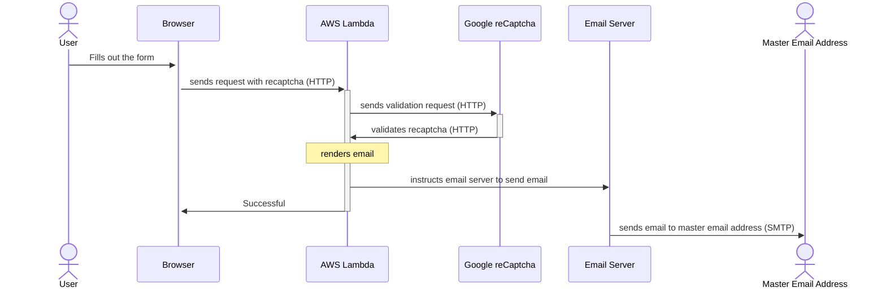

email-sender
====
Contact form AWS lambda application: 
This is a Proof of concept application that lets users of a webpage to contact an email address (for example an administrator of the website), without an email address. It has an AWS lambda backend, and a svelte frontend. This application will show form. If it is properly filled, then it will send it's content in an email to the designated email address. To deploy, and run this application, you have to have:
- AWS account
- Google reCaptcha application registered
- An email address to send the email from

Create an ```application.properties``` file under the ```email-sender/email-sender/src/main/resources/``` from the template file

Sequence diagram:



